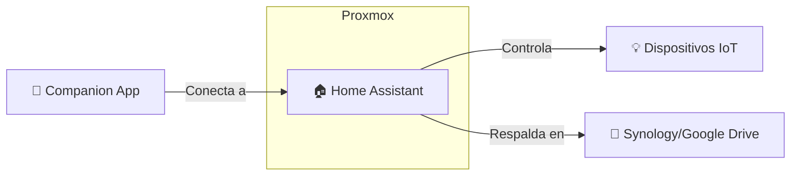

# 🏠 Home Assistant VM

> **Tipo**: VM (HAOS / QEMU)  
> **VMID**: 111  
> **Estado**: 🟢 Running  
> **IP**: 192.168.100.196  
> **Última actualización**: 2025-12-30 (Verificado por Scanner)

---

## 📊 Información General

Esta máquina virtual ejecuta **Home Assistant Operating System (HAOS)**, sirviendo como el cerebro central de la domótica del hogar.

| Campo | Valor |
|-------|-------|
| **Hostname** | home-assistant |
| **Sistema Operativo** | Home Assistant OS (Linux based) |
| **Acceso Web** | [http://192.168.100.196:8123](http://192.168.100.196:8123) |
| **Supervisor** | [http://192.168.100.196:4357](http://192.168.100.196:4357) |
| **VMID** | 111 |

---

## 💻 Recursos Asignados (Proxmox)

| Recurso | Valor |
|---------|-------|
| **CPU** | 2 cores (Host) |
| **RAM** | 4 GB |
| **Disco Principal** | 32 GB (SATA, local-zfs/lvm) |
| **Network** | VirtIO (vmbr0) |

> ⚠️ Confirma si el disco es SSD o HDD en Proxmox para ajustar performance de base de datos.

---

## 🔌 Puertos Expuestos

Detectados por escaneo activo:

| Puerto | Servicio | Estado | Descripción |
|--------|----------|--------|-------------|
| **8123** | HTTP | ✅ Open | Interfaz Principal (Lovelace) |
| **4357** | HTTP | ✅ Open | HA Supervisor Observer |
| 22 | SSH | 🚫 Closed | Acceso SSH del sistema base (deshabilitado por defecto en HAOS) |
| 1883 | MQTT | 🚫 Closed | Broker MQTT (Probablemente usando Add-on o externo) |

---

## 🏠 Integraciones Detectadas

### Protocolos
- **mDNS/Discovery**: Detectado tráfico multicast.
- **Zigbee**: (Pendiente confirmar si usa USB Passthrough de ConBee/SkyConnect).
- **Bluetooth**: (Pendiente verificar integración).

### Add-ons Probables
Al estar cerrados 1883 y otros puertos, es probable que los add-ons (Node-RED, Mosquitto, Z2M) estén o no instalados, o no expuestos en puertos externos (Ingress).

---

## 🔗 Dependencias y Relaciones

---

## 📝 Notas de Mantenimiento

1.  **Backups**: Configurar backups automáticos (Google Drive Backup Add-on recomendado).
2.  **Actualizaciones**: HAOS se actualiza desde la interfaz UI.
3.  **Acceso Externo**: Actualmente no detectado proxy reverso directo en puertos estándar. (¿NPMplus maneja esto?)
